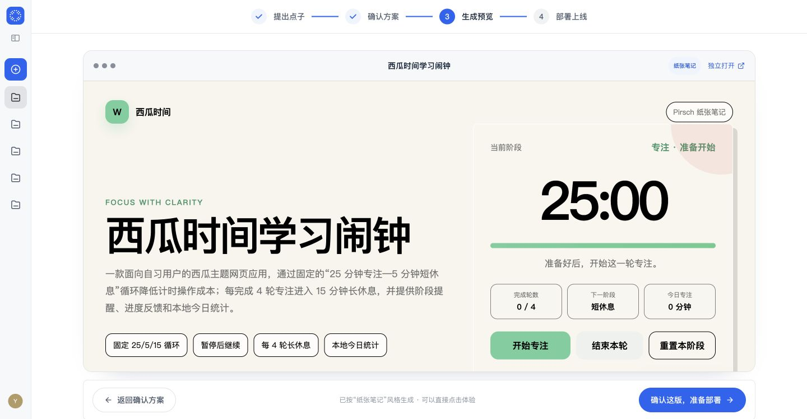
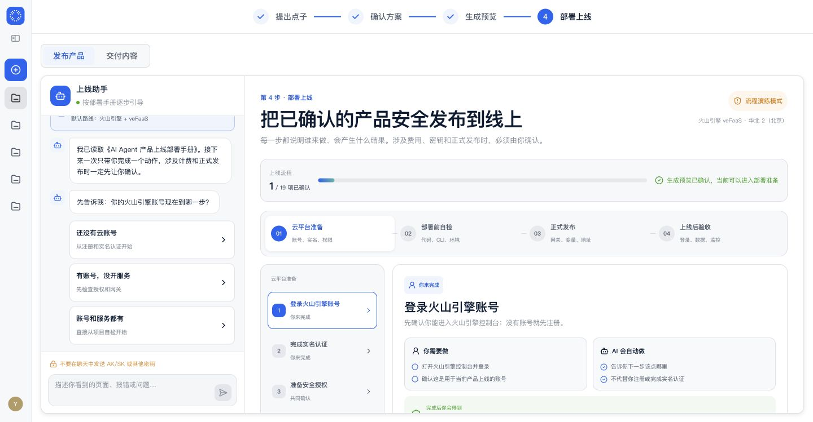

# 点线面 · AI 产品生成中台

从一句产品想法或一份 PRD 出发，通过「提出点子 → 确认方案 → 生成预览 → 部署上线」四步，把需求逐步变成可以确认、可以操作、可以交付的 Web 产品。

[](https://daaaayuuuu.github.io/point-line-plane/)
[](./frontend)
[](./backend)

> [在线项目展示](https://daaaayuuuu.github.io/point-line-plane/)用于浏览产品结构和真实页面截图。完整产品需要同时启动本仓库的前端与后端；当前仓库默认关闭真实云部署适配器，不会伪造公网产品地址。

## 可交互产品预览

第三步读取已确认的 PRD、低保真方案和 UI 风格，生成真实 HTML 页面。用户可以直接操作核心流程，再决定确认上线或返回修改方案。

[](https://daaaayuuuu.github.io/point-line-plane/)

## 部署上线工作台

第四步采用左侧上线助手、右侧部署流程的结构。流程依据《AI Agent 产品上线部署手册》拆成云平台准备、部署前自检、正式发布和上线后验收，并明确区分用户操作、AI 自动处理、费用确认与密钥安全。



## 四步产品流程

| 阶段 | 用户看到什么 | 阶段产物 |
| --- | --- | --- |
| 1. 提出点子 | 对话式澄清、附件读取、完整 PRD 预览 | 已确认 PRD |
| 2. 确认方案 | 可视化低保真故事板、关键页面与 UI 风格选择 | 已确认产品方案 |
| 3. 生成预览 | Loading 生成状态、真实 HTML、可点击核心流程 | 可验收 Web 产品 |
| 4. 部署上线 | 上线助手、云资源检查、费用确认、验收清单 | 线上地址与交付内容 |

## 技术架构

```text
Browser
  └─ frontend/  React 19 + TypeScript + vinext
       └─ REST API
            └─ backend/  FastAPI + SQLAlchemy + Alembic
                 ├─ PRD / 方案 / 生成任务 / 预览
                 ├─ 凭证加密 / 用量 / 部署授权 / 交付
                 └─ SQLite（本地）或 PostgreSQL（生产）
```

- 前端：React 19、TypeScript、vinext、Lucide Icons
- 后端：FastAPI、SQLAlchemy、Alembic、Pydantic、Cryptography
- AI：默认 `mock`，支持受控外部模型配置
- 生成运行：受控工作区、质量门、有限修复、HTML 预览
- 安全：邀请码登录、租户隔离、凭证加密、部署前费用确认

## 仓库结构

```text
.
├── frontend/          # 当前产品前端
├── backend/           # 当前实际使用的完整后端（原第八阶段）
├── agent-blueprint/   # PRD 生成实际读取的 Agent 架构蓝图
├── media/             # README 高清产品截图
├── site/              # GitHub Pages 项目展示页
└── .github/workflows/ # Pages 自动部署
```

第一至第七阶段属于历史开发快照，不是当前运行依赖，因此没有放入本仓库。

## 本地运行

### 1. 启动后端

要求：Python 3.11、[uv](https://docs.astral.sh/uv/)。

```bash
cd backend
cp .env.example .env
# 修改 .env 中的 SESSION_SECRET、INVITE_CODES 和 OPERATIONS_TOKEN
uv sync --dev
uv run alembic upgrade head
uv run uvicorn app.main:app --host 127.0.0.1 --port 8018
```

后端健康检查：`http://127.0.0.1:8018/api/v1/health`

### 2. 启动前端

要求：Node.js 22.13 或更高版本。

```bash
cd frontend
cp .env.example .env.local
npm ci
npm run dev
```

打开：`http://localhost:3000`

## 验证

```bash
# frontend/
npm run typecheck
npm run lint
npm test

# backend/
uv run pytest
```

## 真实能力边界

- `AI_PROVIDER=mock` 时不会调用外部模型。
- `DEPLOYMENT_ENABLED=false`、`DEPLOYMENT_MODE=mock` 时只展示部署流程，不创建云资源，也不返回虚假公网地址。
- 真实模型、生成沙箱、云部署、GitHub 同步和生产备份必须接入受信任的外部适配器。
- `.env`、云密钥、本地数据库、对话数据、生成工作区和运行缓存均不应提交到 Git。
