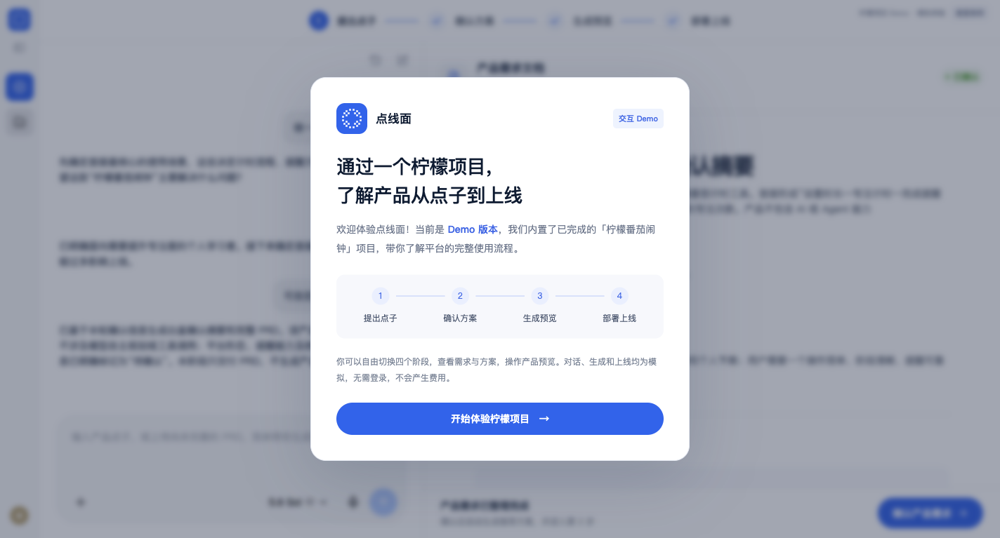
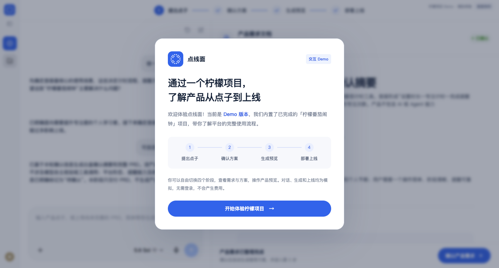

# 点线面 · 从一个点子到产品正式上线

通过「提出点子 → 确认方案 → 生成预览 → 部署上线」四步，了解一个产品如何从想法走到交付。

**[访问产品首页](https://daaaayuuuu.github.io/point-line-plane/) · [立即体验点线面](https://daaaayuuuu.github.io/point-line-plane/demo/)**


## 用柠檬项目体验完整流程

这是点线面的产品落地页和交互 Demo 仓库。点击首页「立即体验」，即可进入内置的 **柠檬番茄闹钟** 项目，无需安装、登录或连接 Codex 账号。

Demo 直接复用点线面原版前端组件和交互，以已完成的柠檬项目展示全流程。首次进入的欢迎弹窗会说明体验方式；你可以自由切换四个阶段，也可以重置案例重新体验。


| 阶段 | 可以体验什么 |
| --- | --- |
| 1. 提出点子 | 查看柠檬历史对话、完整 PRD，体验模拟对话和需求确认 |
| 2. 确认方案 | 查看低保真原型、关键页面，选择 UI 风格并确认方案 |
| 3. 生成预览 | 体验模拟生成进度，操作柠檬闹钟的设置、开始、暂停、继续和完成提醒 |
| 4. 部署上线 | 查看上线助手、七步流程与已完成的案例发布记录，体验模拟发布和验收 |

### 提出点子与确认方案


### 生成预览与部署上线





## 体验边界

- 对话、生成、账号连接和部署操作均为浏览器内模拟，不调用真实 AI，也不创建云资源。
- 内置预览可以实际操作，生成结果始终围绕柠檬案例，不会根据任意输入生成新产品。
- Demo 无需登录，不消耗 Codex 额度，不产生 AI 调用或部署资源费用。
- 体验数据保存在当前浏览器，点击「重置案例」恢复初始状态，不会影响其他访客。
- 落地页另有柠檬产品的独立访问链接；平台 Demo 入口始终为本仓库的 `/demo/`。

## 仓库结构

```text
.
├── site/                       # 可直接发布的完整静态网站
│   ├── index.html              # 落地页
│   ├── styles.css              # 落地页样式
│   ├── navigation.js           # 导航交互
│   ├── media/                  # 落地页图片
│   └── demo/                   # 已构建的交互 Demo 与柠檬产品预览
├── demo-source/                # Demo 可编辑、可重新构建的源码
│   ├── features/               # 原版点线面 React 组件
│   ├── app/                    # 原版样式与设计变量
│   ├── lib/                    # 类型与组件依赖
│   ├── public/                 # 原版静态资源
│   └── static-demo/            # 内置柠檬数据、模拟接口、欢迎弹窗与构建适配
├── media/                      # README 当前页面截图
├── scripts/test-static-demo.mjs # Demo 验证脚本
└── .github/workflows/pages.yml # GitHub Pages 自动发布
```

## 本地查看

直接运行静态网站，无需安装前后端依赖：

```sh
python3 -m http.server 8086 --directory site
```

打开 `http://localhost:8086/` 查看落地页，点击「立即体验」进入 Demo。

## 修改与构建 Demo

需要 Node.js 22.13 或更高版本：

```sh
cd demo-source
npm ci
npm run dev
```

修改后构建回 `site/demo/`：

```sh
npm run build
npm run typecheck
cd ..
node --test scripts/test-static-demo.mjs
```

落地页可直接编辑 `site/index.html`、`site/styles.css` 和 `site/navigation.js`。欢迎弹窗位于 `demo-source/static-demo/main.tsx`，样式位于同目录的 `notice.css`。

## GitHub Pages 发布

仓库 Settings → Pages 的 Source 使用 **GitHub Actions**。推送 `site/` 更新到 `main` 后，工作流自动发布，也可在 Actions 手动运行。

该仓库发布的是静态落地页和演示应用，无需后端服务器或数据库。源码中的原 API 合约仅用于组件类型兼容；Demo 构建通过别名使用浏览器模拟接口，不包含真实 API 客户端。详情见 [Demo 开发说明](STATIC-DEMO.md)。
